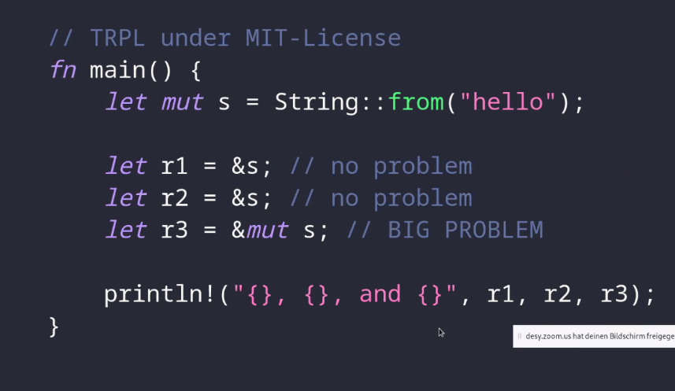
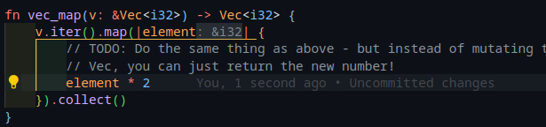
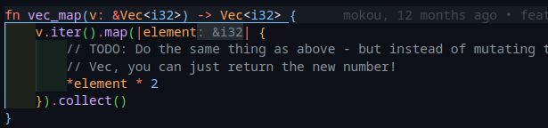
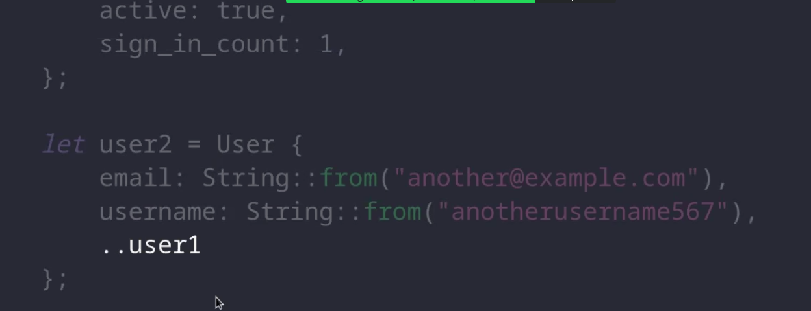
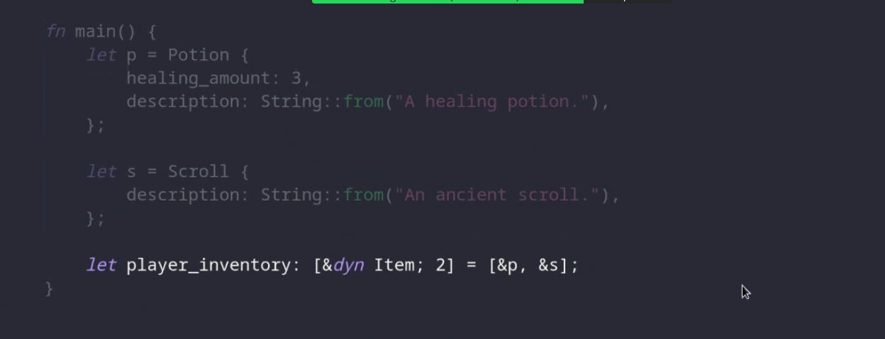

Sebastian
- works on https://helmholtz.cloud/ in desy IT


build project folder: `cargo init hello`

- `cargo run --release` for optimised target
- `cargo run` for debug target

println! is a macro, not a function. note `!` at the end.
Q: where is the macro defined?
A:
missing vscode codelese to auto infere type of variable
\Q: Can you have emaojis in variable names?

- use `_` in numbers for seperation


# ruslings
```shell
git@github.com:rust-lang/rustlings.git
cd
 4917  git checkout tags/5.5.1
 4918  cargo install --force --path .
 4919  rustlings watch
```

work on intro and variables sections

# Functions
`;` are used to suprress output
if you dont have it the last line is returned
even good idea with if
eg:
```rust
fn main() {
    let x = 5;
    let y = {
        let x = 3;
        x + 1
    };
    println!("The value of y is: {}", y);
}
```
and
```rust
pub fn bigger(a: i32, b: i32) -> i32 {
    // Complete this function to return the bigger number!
    // Do not use:
    // - another function call
    // - additional variables
    if a>b {
        a
    } else {
        b
    }
}
```
work on functios if and types in rustlings

# Ownership
Like RAAI fro C++ but with a twist
- only one owner at a time


`*.clone()` is a deep copy
`*.copy()` is a shallow copy (only for types that implement `Copy` trait)
Q: diff between str: = "asdf" and String::from("asdf")
A: str is a string literal, String is a heap allocated string

## borrowing
- only one mutable borrow at a time
- almost like the address of operator from C ( `&` )
- read only references are passed so no write operations are possible with the reference
-eg:
```rust
fn main() {
    s1 =String::from( "asf" );
    len = calculate_length(&s1) ;
    println!("The length of '{}' is {}.", s1, len);

}
fn calculate_length(s: &String) -> usize {
    s.len()
}
```
- `&mut` for mutable references ( variable must also be mutable)
-" function consumes the variable unless you use a reference ( borrow) it"
Q: why can you have two references to the same variable?

- can have mutable and immutable references at the same time ( lol why?)
eg:
```rust
fn main(){
    s = String::from("asdf");
    let r1 = &s;
    let r2 = &s;
    s.push_str("jkl;"); // error here
    println!("{}, {}", r1, r2);
}
```


# Day 2
## Guessing game

- `std::io::stdin` is used to read from stdin
- .expect() is used to handle errors
- find packages using lib.rs
- rand crate is used for random numbers
  Q: is lib.rs the official package manager?
  A: no, crates.io is the official package manager
- Q: what is :: in std::io::stdin
  A: it is a namespace operator
- Q: what is a namespace operator?
  A: it is used to access items in a namespace
- Q: is it like a class?
  A: yes, but it is not a class
- Q: why
-
```
let input:i32 = match std::io::stdin().read_line(&mut guess).parse(){
    Ok(num) => num,
    Err(_) => continue,
};
```
- `match` is like a switch statement
#### Tuples
- `let tup: (i32, f64, u8) = (500, 6.4, 1);`
- access with `tup.0` etc

#### Arrays
- `let a: [i32;5] = [1, 2, 3, 4, 5];`
- `println!("{:#?}", a); // pretty print`)
- no mixing of types
- `let a = [0;30] // 30 zeros`
- Q: if its a literal you dont need to specify the type?
  A: yes
- Q: why?
  A: because the compiler can infer the type
- variable length arrays are not supported
- compile time leght is posible using cost of type `usize` eg:
```
const MAX_POINTS: usize = 100_000;
fn main(){
    let a: [i32,MAX_POINTS] = [0;MAX_POINTS];
}
```
- Q: what is the difference between `usize` and `isize`
  A: `usize` is unsigned and `isize` is signed

- Q: is there a type() method similar to python?
  A: no, but you can use `std::mem::size_of_val(&a)` to get the size of a variable

- Strings vs string slices:
- `let s = "hello";` is a string slice
- `let s = String::from("hello");` is a string


### vectors
- lists when length is not known at compile time
-
```
   let mut v: Vec<i32> = Vec::new();`
  v.push(5);
  v.push(6);
  v.push(7);
```
- new() keyword as it is defined in heap
- In Rust, there are two ways to define a Vector.
1. One way is to use the `Vec::new()` function to create a new vector
  and fill it with the `push()` method.
2. The second way, which is simpler is to use the `vec![]` macro and
  define your elements inside the square brackets.


- Q: can you mix and match types in a vector?
  A: no
- pre alocate with `Vec::with_capacity(10)`

- Q: how does vec work internally?
  A: it is a wrapper around a pointer to a heap allocated array
- Q: how does it grow?
  A: it doubles in size when it is full
- Q: is it implemneted like a linked list?
  A: no, it is implemented like a dynamic array
- Q: what is the difference between a linked list and a dynamic array?
  A: a linked list is a collection of nodes that point to each other, a dynamic array is a pointer to a heap allocated array

- access nth element with `v[n]` or `v.get(n)` which returns an option
- Q: what is an option?
  A: it is an enum that can be either `Some(T)` or `None`
- Q: what is an enum?
  A: it is a type that can be one of several variants

- Q: what is the difference between `v[n]` and `v.get(n)`?
  A: `v[n]` panics if the index is out of bounds, `v.get(n)` returns an option
- option vs result enum
- Q: what is the difference between an option and a result?
  A: an option is used when there is no error, a result is used when there is an error
- Is the return type of result and option dynamic? ie can '.get' return a result sometimes  and an option some other times?

- iterate over a vector with `for i in &v`
- mutable iteration with `for i in &mut v`

- work through all rustlings until structs1

Unclear why this works:

element is passed as reference seen in the inference but the *2 still works on the reference
What should def work ( which also works):



Q: Why is the syntax for accessing a tuple different from accessing a vector?


## Structs

```rust
struct User {
    username: String,
    email: String,
    sign_in_count: u64,
    active: bool,
}
```
- use pub to make public else useable only within the module
- define an instance with:
```rust
let user1 = User {
    email: String::from("bla@bla.com"),
    username: String::from("blabla"),
    active: true,
    sign_in_count: 1,
};
```
- can copy values from another instance with:
```rust
let user2 = User {
    email: String::from("hah@he.com"),
    ..user1
};
```

- tuple structs
```rust
struct Color(i32, i32, i32);
struct Point(i32, i32, i32);
let black = Color(0, 0, 0);
let origin = Point(0, 0, 0);
```
usefull for when you want to give a name to a tuple
- unit like structs
```rust
struct MyUnitStruct;
let test = MyUnitStruct;
```
- cant store values but can define traits. eg:
```rust
struct MyUnitStruct;
impl MyUnitStruct {
    fn my_method(&self) {
        println!("my method");
    }
}
let test = MyUnitStruct;
test.my_method();
```
- Q: what is a trait?
  A: a trait is a collection of methods that can be implemented by a struct

- usefull when you want to implement a trait on a type but dont need to store any data

- poor mans version of sets as in golang ??
- Q: are structs in rust the same as classes?
A:
- work until enums1

## Traits
- to get a json like out put from the struct use `println!("{:#?}", user1);`
- Google : display representation vs debug representation
- implemnet a trait with:
```rust
impl fmt::Display for Potion {
    fn fmt(&self, f: &mut fmt::Formatter) -> fmt::Result {
        write!(f, "({}, {})", self.color, self.volume)
    }
}
```
here `f` is a formatter.

- Q: what is Derive[#debug]?
A: it is a macro that implements the debug trait for you

Google: entity componenet system design pattern




## Options and Results


- usefull crates:
- rayon for parallelism
- crossbeam for multi threading and message passing
- parking_lot - concurrency primities
- indicatif - progress bars, cli
- reqwest - http client
- serde - (de)serialization
- tonic - grpc microservices
- nalgebra - linear algebra
- cgmath - linear algebra

example projects:
- rougelike rustbook ( bracketproduction)
- os.phill-opp.com
- redoc-os.org
- raytracing.github.io
- pbr-book.org academy award winning book on rendering
- chip8 emulator : devernay.free.fr/hacks/chip8/C8TECH10.HTM